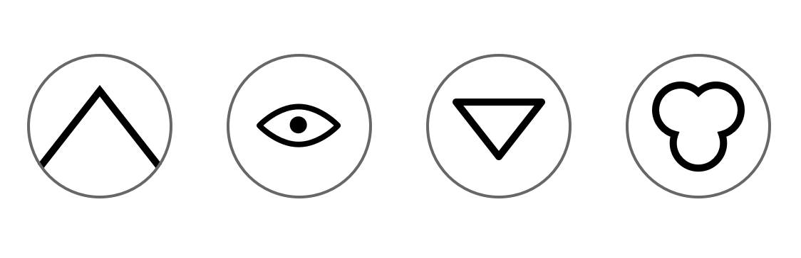

# Introduction

{ width=100% }

Hello, and welcome to Adventure Club. We are excited you are making the choice to
join us.

This book will serve as a starting point for picking worthwhile adventures to take,
and as a guide for getting the most out of your adventuring.

But first, some information about what Adventure Club is, and how it is organized.

## The Club

Adventure Club is about getting you out into nature.
The club will serve to guide help with your nature adventures, without getting in the way of your discoveries and experiences.

The club will provide guidance and leadership for this nature exploration.

## Adventures

As you might have guessed, Adventure Club's main focus is on taking adventures.

In the club, an adventure is a specific experience you take part in.
Some adventures have specific tasks

This book provides you with adventures suggested by the Adventure Club.

Adventures should be worthwhile, interesting, and fun.

## Adventure Types

Adventuring comes in many forms and can happen in many locations.
To highlight these different avenues into adventures, this handbook is organized into four different sections highlighting where and how these different adventures can occur.

* _Adventures in the wild_ will look at adventuring in the great outdoors.
* _Adventures in the city_ will look at urban exploration and all the mysteries your hometown can hold.
* _Adventures in the home_ focuses on having fun in your own home. Adventures lie behind every door and in every cabinet.
* _Adventures in the mind_ dives into your own imagination to show the adventures that can be found there.

## Adventure Badges

Completing the right combinations of adventures will earn you adventure badges.

# Adventures in the Wild

{ width=100% }

## Hiking

### Finding a Trail

### Map Reading

### Navigation

### Hiking Badge

## Camping

### Supplies

### Setup

### Outdoor Cooking

### Camping Badge

## Animal Observation

### Track Identification

### Animal Tracking

### Animal Badge

## Plant Identification & Foraging

### Identifying Plants

### Eating Wild Plants

### Plant Badge

# Adventures in the City

{ width=100% }

## Urban exploration

### Urban Badge

# Adventures in the Home

{ width=100% }

# Adventures in the Mind

{ width=100% }
